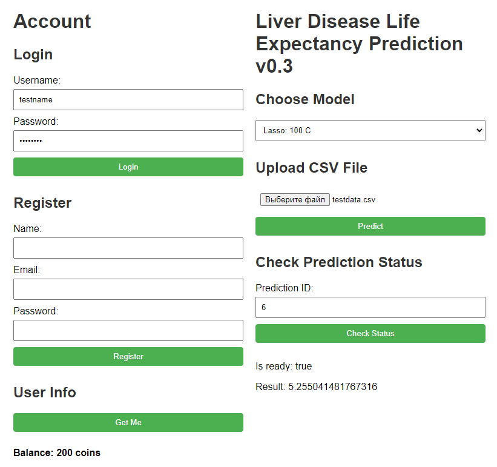
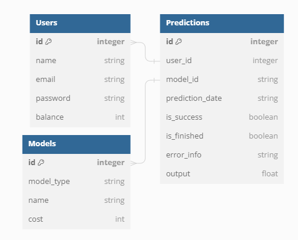

# Billing-based ML Service: Liver Disease Lifespan Predictor

## Description/Описание

Для получения предсказания примерной ожидаемой продолжительности жизки (+- 1.5 года) пользователю необходимо зарегистрироваться в сервисе, после чего подготовить .csv-файл с данными ([образец доступен по ссылке](configs\input\cirrhosis.csv)) и выбрать ML-модель.

Новым пользователям по умолчанию доступно 500 C (coins) для использования моделей.

Проект представляет собой сервис машинного обучения (ML), построенный с использованием FastAPI, современного и быстрого веб-фреймворка для создания API с Python 3.7+. Сервис включает в себя различные компоненты, в том числе аутентификацию пользователей, управление моделями и обработку предсказаний. Вот краткий обзор ключевых компонентов и функциональных возможностей:
### Аутентификация:

Пользователи могут регистрироваться и входить в систему с помощью конечных точек аутентификации.
Для защиты и аутентификации API-запросов используются токены JWT. Пароли пользователей хранятся в зашифрованном виде.

### Управление моделями:

Система поддерживает управление моделями машинного обучения.
Модель по умолчанию: Lasso. Добавление дополнительных моделей не составит трудностей благодаря универсальной структуре Model Wrapper.

### Обработка прогнозов:
Пользователи могут отправлять файлы данных для прогнозирования с помощью ML-моделей.
Прогнозы обрабатываются асинхронно с помощью очереди Redis, что обеспечивает масштабируемость и эффективную обработку запросов на прогнозирование.

### База данных:
База данных SQLite используется для постоянного хранения информации о пользователях, моделях машинного обучения и результатах предсказаний.
SQLAlchemy используется в качестве ORM для взаимодействия с базой данных.

### REST API:

Сервис предоставляет RESTful API с конечными точками для управления пользователями, работы с моделью и запросами на прогнозирование.
Маршруты API организованы с помощью модульной системы маршрутизации FastAPI.

### Взаимодействие с фронтендом (HTML/JS):

Веб-страница HTML/JS позволяет пользователям взаимодействовать с сервисом, включая аутентификацию пользователей, выбор модели, загрузку файлов и проверку статуса предсказания.
Фронтенд взаимодействует с API бэкенда для выполнения действий и получения информации.
Для запуска приложения FastAPI используется Uvicorn.
Проект может быть легко развернут и масштабирован благодаря модульной конструкции и возможности асинхронной обработки.

### Доступные модели и стоимость предсказания
- Lasso - 100 C;

### Структура API
Не требуют авторизации:
- POST /api/auth/login — вход в систему;
- POST /api/auth/register — регистрация в системе;

Требуют авторизации:

- GET /api/auth/me — информация о текущем авторизованном пользователе;
- GET /api/auth/balance — проверить баланс пользователя;
- POST /api/predict/{model_id} — отправить файл с данными для получения предсказания;
- GET /api/predict/{prediction_id} — получить результат работы модели/статус запроса (в работе/отклонен);

## Setup/Начало работы

1. Create and activate Python environment using Virtualenv or conda. Tested versions: `python-3.9`
2. Install requirements: `pip install -r requirements.txt`
3. Run app: `python app.py` Optional args: 
- `--port` - 7999 by default
- `--host` - 127.0.0.1 by default
- `--resetdb` - False by default. True to re-create DB.

## Database scheme/Схема БД

